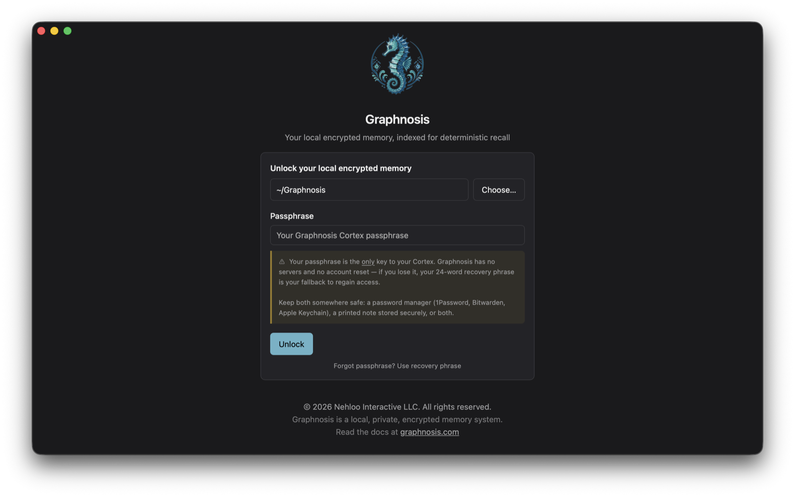
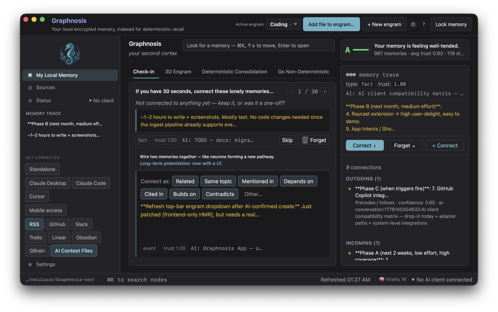
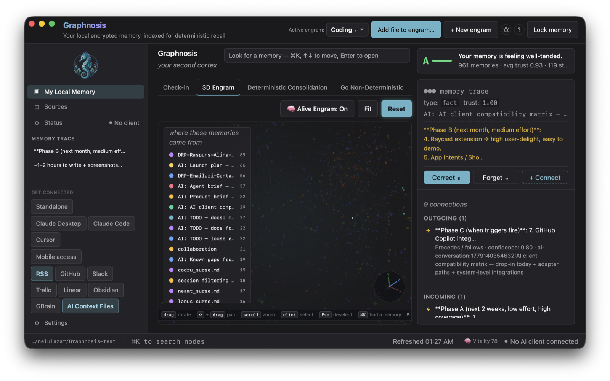
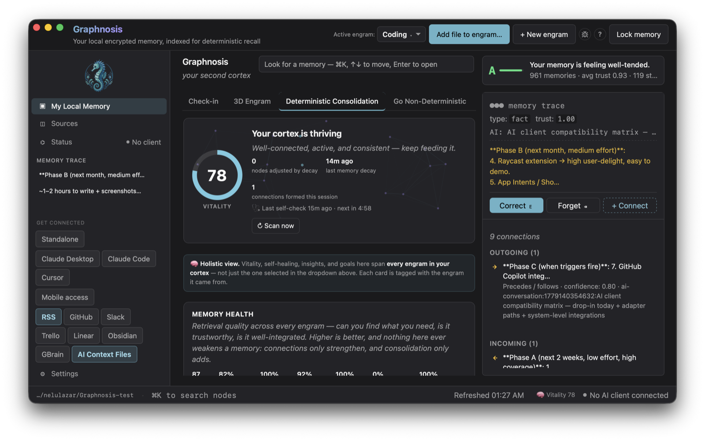
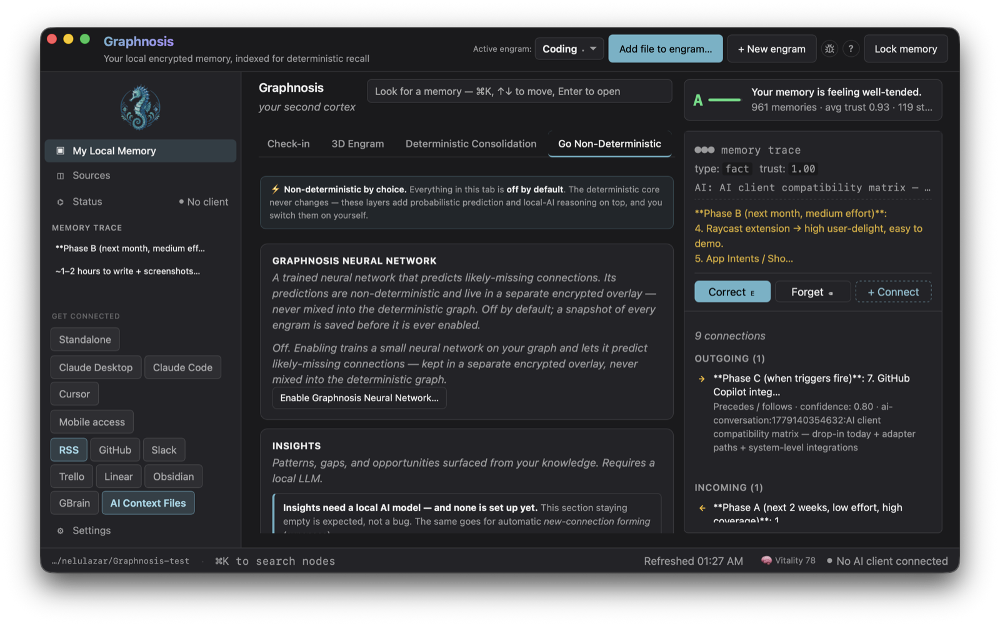
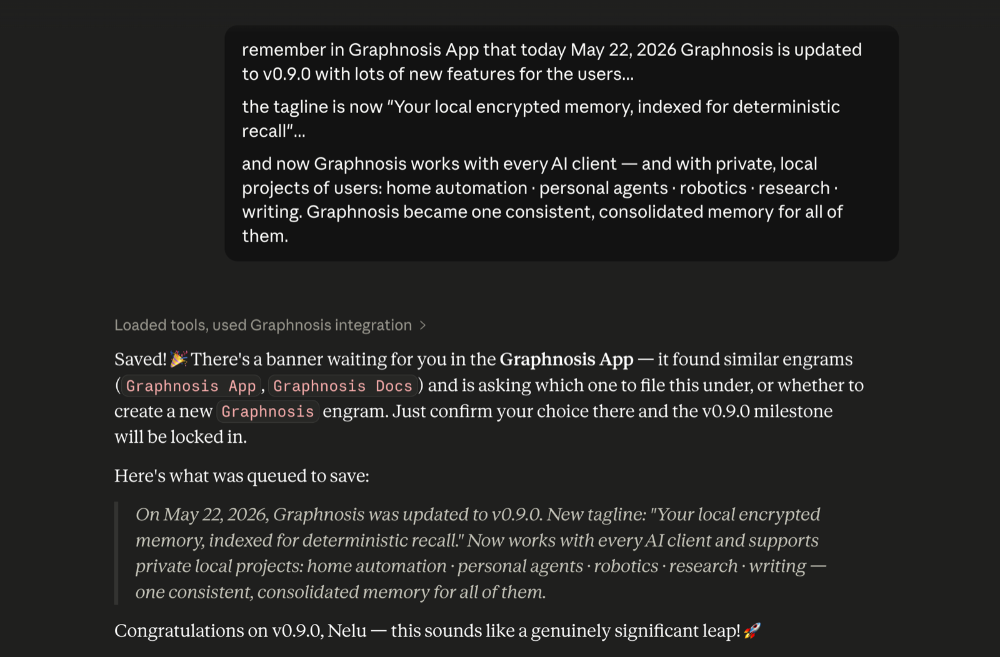
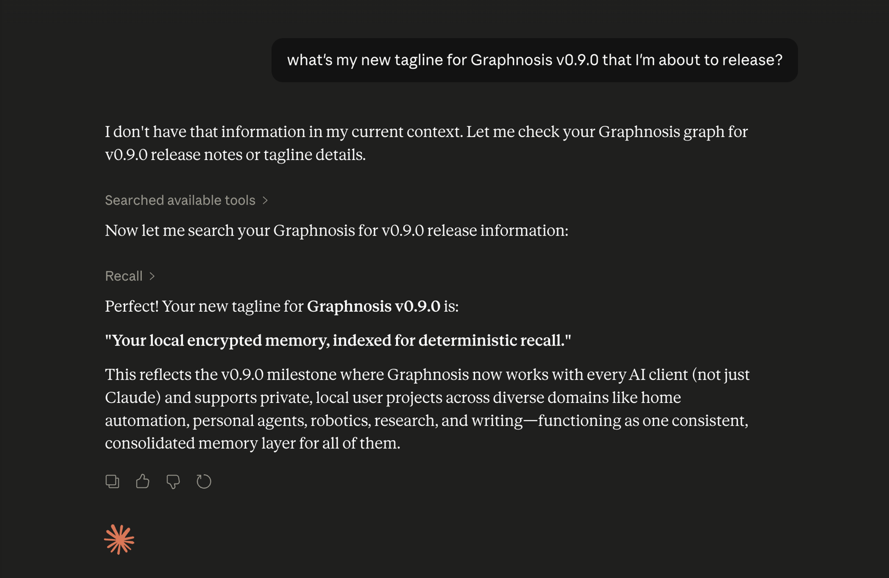

# Graphnosis™

> Private second memory for any AI. Local-first, encrypted, multi-graph.
> Attaches a relevant subgraph from your own memory to every prompt you send
> to any MCP-aware AI — no effort, no API keys, no AI literacy required.

**Product name:** Graphnosis · **Domain:** [graphnosis.com](https://graphnosis.com) (primary) · [graphnosis.app](https://graphnosis.app) (downloads) · [graphnosis.org](https://graphnosis.org) (OSS) · [graphnosis.ai](https://graphnosis.ai) (reserved)
**Repo:** Graphnosis App (this monorepo) · **Engine:** [`@nehloo/graphnosis`](https://www.npmjs.com/package/@nehloo/graphnosis)

---

## Status

**Private alpha.** This repository is private during foundational development. Source will be made available at public launch under the [Functional Source License 1.1 (FSL-1.1-Apache-2.0)](LICENSE) — both so users can verify the privacy promises ("your memory never leaves your device") and so the community can audit and contribute. The license converts to Apache 2.0 two years after each release.

The underlying engine, [`@nehloo/graphnosis`](https://github.com/nehloo/Graphnosis), is already open source under Apache 2.0.

---

## What it does

1. You pick a folder (local or iCloud/Drive) where your encrypted memory lives.
2. You feed it things worth remembering:
   - **Files** from Finder (in place — files stay where they are)
   - **Web pages or selected text** via Share Sheet / global hotkey
   - **AI conversation notes** via "remember this" inside Claude / Cursor / Claude Code
3. Anytime you talk to an MCP-aware AI, a relevant federated subgraph from your memory gets attached, within a tight token budget. The AI answers as if it knew you.
4. You correct it in natural language (*"the trip was September, not August"*). A bundled local LLM produces a structured diff, you confirm, the graph updates — privately, on-device.
5. Optionally, you enable **Non-Deterministic Aid**: five independently-toggleable LLM capabilities (recall enrichment, correction parsing, distillation, insights, edge prediction) each opt-in, each running entirely on your machine via Ollama.

The full `.gai` files never reach the AI. The AI only ever sees the scoped subgraph relevant to the current prompt — and that subgraph is hard-capped by per-graph **sensitivity tiers** (`public` / `personal` / `sensitive`) that the AI cannot override.

---

## Screenshots

Unlock your cortex with a passphrase or Touch ID, then work across four tabs — daily check-ins, the 3D engram (grab to rotate, ⌘-drag to pan), deterministic consolidation, and the optional non-deterministic layer. The status bar shows live GLL/GNN overlay activity pills that pulse when an inference engine is running.



| | |
|:--:|:--:|
| <br>**Check-in** — connect lonely memories | <br>**3D Engram** — explore the whole graph |
| <br>**Deterministic Consolidation** — vitality & memory health | <br>**Go Non-Deterministic** — the optional AI layer |

And the recall / remember loop, working live with an AI client:

| | |
|:--:|:--:|
| <br>**remember** — your AI saves a memory; Graphnosis asks which engram first | <br>**recall** — any client pulls it back from your encrypted graph |

<sub>Claude is shown to demonstrate the MCP integration. Graphnosis is an independent product, not affiliated with or endorsed by Anthropic.</sub>

---

## Architecture

```
┌────────────────────────────────────────────────────────────────────────────┐
│  Tauri shell (Rust) — apps/desktop                                          │
│  - menu bar, hotkeys, Share Sheet receiver                                 │
│  - OS keychain (Touch ID / Windows Hello)                                  │
│  - folder watcher + op-log sync engine                                     │
│  - spawns and supervises the Node sidecar                                  │
└────────────────────────────────┬───────────────────────────────────────────┘
                                 │  Unix socket (newline JSON-RPC)
                                 ▼
┌────────────────────────────────────────────────────────────────────────────┐
│  Node sidecar (TypeScript) — apps/desktop-sidecar                          │
│  - GraphnosisHost: encryption at rest, op-log, source index                │
│  - ingest (file / web / clip); large files chunked for responsiveness      │
│  - correction pipeline (local LLM via Ollama → structured diff)            │
│  - local embeddings via fastembed (BGE-small-en-v1.5, ONNX)                │
│    → PDF parsing offloaded to a worker_threads Worker (pure JS, safe)      │
│    → ONNX inference runs in a pool of forked child processes (N-API safe)  │
│  - federated query across all user graphs with tier-capped budgets         │
│  - MCP server over stdio: 35 tools in 9 categories (recall, remind,         │
│    dig_deeper, remember, correct, apply, forget, stats, list_engrams,      │
│    recall_with_citations, compare_engrams, audit_memory, llm_query, …      │
│    see /reference/mcp-tools)                                                │
└────────────────────────────────┬───────────────────────────────────────────┘
                                 │
                                 ▼
┌────────────────────────────────────────────────────────────────────────────┐
│  Embedding worker pool (forked child processes)                             │
│  - 2 × node embed-worker.js, each with its own fastembed / ONNX session    │
│  - Round-robin dispatch; parent event loop never blocked by inference      │
│  - Pool size: GRAPHNOSIS_EMBED_WORKERS (default 2)                         │
└────────────────────────────────────────────────────────────────────────────┘
                                 │
                                 ▼
                  ┌─────────────────────────────┐
                  │  @nehloo/graphnosis SDK     │
                  │  (Apache 2.0, npm)          │
                  └─────────────────────────────┘
```

---

## Repo layout

```
apps/
  desktop/              Tauri app (Rust shell + minimal HTML/JS UI)
  desktop-sidecar/      Node TypeScript sidecar (Graphnosis + MCP + IPC)
    src/
      index.ts          Entry point — boot, IPC, MCP, signal handling
      host.ts           GraphnosisHost wrapper (ingest, ingestChunked, save, recover)
      ingest.ts         File/web/clip ingest; PDF parsed in worker thread
      pdf-parse-worker.ts  worker_threads PDF parser (pdfjs off the main thread)
      local-embed.ts    Fork-based embedding pool (round-robin, 2 workers default)
      embed-worker.ts   Forked child: owns one fastembed / ONNX session
      embedding-queue.ts  Mutex: serializes ONNX calls between concurrent ingests
      ipc.ts            Unix-socket JSON-RPC server for Tauri shell
      mcp-server.ts     35 MCP tool definitions in 9 categories (recall, …)
packages/
  graphnosis-app-core/  Crypto, op-log, source index, federation,
                        sensitivity tiers, embeddings cache, policy
```

---

## MCP tools exposed to AI clients

The sidecar exposes **35 tools** in 9 functional categories. The desktop app
ships an in-app browser for them (left sidebar → **MCP Tools**), and the
full reference with parameters, return shapes, and example prompts lives
at [graphnosis.com/reference/mcp-tools](https://graphnosis.com/reference/mcp-tools/).

| Category | Tools |
|---|---|
| **Core memory** | `recall` · `remind` · `dig_deeper` · `remember` · `forget` · `apply` · `stats` · `vitality` |
| **Engram discovery** | `list_engrams` · `suggest_engram` · `browse_engram` · `recent` · `get_engram_schema` |
| **Structured recall** | `recall_structured` · `recall_with_citations` · `compare_engrams` · `cross_search` |
| **Source operations** | `find_source` · `recall_source` · `transfer_source` |
| **Engram operations** | `ingest_batch` · `engram_summary` |
| **Brain maintenance** | `duplicate_pairs` · `healing_journal` · `gnn_status` · `confirm_data_access` |
| **Approximate** (similarity, no LLM) | `audit_memory` · `check_duplicate` |
| **Conditional** (deterministic by default, LLM-aware) | `correct` |
| **Non-deterministic** (Local LLM required) | `develop` · `predict` · `insights` · `gnn_neighbors` · `llm_query` · `llm_distill` |

`recall` has the hardest caps: `maxNodes ≤ 50`, `maxTokens ≤ 8000`,
clamped further on sensitive engrams (≤ 5 nodes / 500 tokens). Every
recall returns an audit footer showing per-graph attribution.

---

## AI clients that read from your cortex

Any MCP-aware AI client speaks Graphnosis natively — no API keys, no
custom plugin. The desktop app ships first-day-supported configuration
flows for the four most common:

| Client | Status | Setup |
|---|---|---|
| **Claude Desktop** | Supported (macOS + Windows) | Settings → AI clients → Configure Claude Desktop |
| **Claude Code** | Supported (macOS + Windows) | Settings → AI clients → Configure Claude Code |
| **Cursor** | Supported (macOS + Windows) | Settings → AI clients → Configure Cursor |
| **Zed** | Supported | Standard MCP config — see docs |
| **Any MCP-aware tool** | Supported | Standard MCP config — point at the relay |
| **VS Code / Copilot Chat** | Supported (HTTP bridge) | Bundled Graphnosis VS Code extension |
| **ChatGPT** | Coming soon | Browser extension |
| **Gemini** | Coming soon | Browser extension |

Every connection sees the same 35 tools above; what each client can
actually read is governed by the [consent gate](https://graphnosis.com/guides/ai-access-controls/)
(silent for personal-tier engrams, one-click in-app modal for sensitive).

---

## Data sources (cloud auto-ingest)

Built-in connectors poll or receive on a schedule and route incoming
content into the engram of your choice. All credentials stay on-device,
encrypted alongside your cortex.

| Connector | What it pulls | Mode |
|---|---|---|
| **RSS** | Any RSS / Atom feed | Pull, configurable cadence |
| **GitHub** | Issues, PRs, comments, commits | Pull |
| **Slack** | Channel exports, DMs, threads | Pull |
| **Trello** | Cards, comments, attachments | Pull |
| **Linear** | Tickets, comments, project updates | Pull |
| **Obsidian** | Watched vault — every note saves as it changes | Watch |
| **GBrain** | Local Git repo of plain-text notes | Watch |
| **AI Context Files** | `CLAUDE.md`, `AGENTS.md`, `CURSOR_RULES`, `GEMINI.md`, etc. | Watch |
| **Webhook** | Generic HTTP endpoint — `POST` JSON, becomes a memory | Receive |

Each connector has its own routing UI (target engram, sensitivity tier,
schedule). Connectors are **incoming only** — they feed the cortex but
never read from it, so adding more never changes Graphnosis's output
posture (still Standalone for MCP purposes). Full guide:
[graphnosis.com/guides/connectors](https://graphnosis.com/guides/connectors/).

---

## Local & offline sources

The connectors above all talk to cloud SaaS. But Graphnosis itself runs
entirely on-device, and so can the data feeding it. Anything that can
write to a file or hit an HTTP webhook becomes a source — no API keys,
no network round-trip, no data leaving your machine.

| Category | Pattern |
|---|---|
| **Local files & folders** | Drag onto the app, or use Obsidian / AI Context Files / GBrain connectors above |
| **NAS / network drives** | Mount as folder; watch the path |
| **Scanned PDFs / paper records** | Drop the PDF — OCR runs locally, no cloud |
| **Smart-home (Home Assistant, MQTT, Zigbee, Z-Wave)** | Bridge script subscribes to MQTT and POSTs to the Webhook connector |
| **Sensors / IoT / lab instruments / agriculture** | Tiny reader script (serial, USB, network) POSTs to Webhook |
| **Local databases (SQLite, Postgres on LAN, DuckDB)** | Cron-driven export to JSON/CSV + folder watch, or query-and-POST script |
| **On-device notes apps (Apple Notes, Bear, Logseq, Notion local cache)** | App's CLI export → watched folder |
| **Logs (router syslog, security cam DVR, audio recordings)** | Tail script → Webhook; for audio, transcribe locally with whisper.cpp first |
| **Industrial protocols (OPC-UA, Modbus, LoRaWAN)** | Bridge script per protocol → Webhook |

The desktop app surfaces this whole set in the sidebar via the **Local &
offline** chip (next to Standalone), with an explainer modal listing the
categories. The full guide with copy-paste scripts and step-by-step
setup for each pattern lives at
[graphnosis.com/guides/connect-offline-sources](https://graphnosis.com/guides/connect-offline-sources/).

---

## Local development

Prerequisites:
- **Node 20+** (use `nvm install 20 && nvm use 20`)
- **pnpm 9+** (via `corepack enable && corepack prepare pnpm@9 --activate`)
- **Rust toolchain** (`curl https://sh.rustup.rs -sSf | sh`) — only for the Tauri shell
- **Ollama** + `llama3.2:3b-instruct-q4_K_M` — only for the `correct` tool

Setup:

```bash
pnpm install
pnpm -r build
```

Smoke test (no Tauri, no Claude, no LLM required — exercises the full encryption → ingest → recall → forget loop):

```bash
pnpm --filter @graphnosis-app/desktop-sidecar smoke
```

Run the sidecar standalone for MCP wiring into Claude Desktop:

```bash
GRAPHNOSIS_CORTEX="$HOME/Graphnosis" \
GRAPHNOSIS_PASSPHRASE="dev-passphrase-change-me" \
pnpm dev:sidecar
```

Run the full desktop app (requires Rust):

```bash
pnpm dev:desktop
```

---

## Wiring into Claude Desktop

Add to `~/Library/Application Support/Claude/claude_desktop_config.json`:

```json
{
  "mcpServers": {
    "Graphnosis": {
      "command": "node",
      "args": ["/absolute/path/to/GraphnosisApp/apps/desktop-sidecar/dist/index.js"],
      "env": {
        "GRAPHNOSIS_CORTEX": "/Users/you/Graphnosis",
        "GRAPHNOSIS_PASSPHRASE": "your-passphrase",
        "GRAPHNOSIS_DEFAULT_GRAPH": "personal",
        "GRAPHNOSIS_POLICY": "/Users/you/Graphnosis/policy.json",
        "GRAPHNOSIS_LLM": "llama-3.2-3b"
      }
    }
  }
}
```

Optional `policy.json` for per-graph sensitivity tiers:

```json
{
  "graphs": [
    { "graphId": "personal", "tier": "personal" },
    { "graphId": "health",   "tier": "sensitive" },
    { "graphId": "work",     "tier": "public" }
  ]
}
```

After saving, restart Claude Desktop. The MCP server appears as **Graphnosis** in the tool picker with 35 tools.

---

## Environment variables

| Variable | Purpose | Default |
|---|---|---|
| `GRAPHNOSIS_CORTEX` | Folder where encrypted graphs + op-log + caches live | (required) |
| `GRAPHNOSIS_PASSPHRASE` | cortex passphrase, used for Argon2id key derivation | (required) |
| `GRAPHNOSIS_DEVICE_ID` | Stable device identifier (op-log attribution + sync) | `<hostname>-<pid>` |
| `GRAPHNOSIS_DEFAULT_GRAPH` | Graph ID for `remember` when none specified | `personal` |
| `GRAPHNOSIS_POLICY` | Path to JSON with per-graph sensitivity tiers | (none — defaults apply) |
| `GRAPHNOSIS_LLM` | Which catalog LLM to use for `correct` (`llama-3.2-3b`, `qwen-2.5-3b`, `llama-3.2-1b`) | recommended (`llama-3.2-3b`) |
| `GRAPHNOSIS_EMBED_DISABLE` | Set to `1` to skip local embeddings (TF-IDF only) | unset |
| `GRAPHNOSIS_EMBED_CACHE` | Override the model cache dir for fastembed | `~/Library/Caches/GraphnosisApp/models` |
| `GRAPHNOSIS_EMBED_WORKERS` | Number of forked ONNX embedding child processes | `2` |
| `GRAPHNOSIS_IPC_SOCKET` | Override the Unix socket path for Tauri ↔ sidecar IPC | `<cortex>/sidecar.sock` |

---

## Security model — short version

- **At-rest encryption**: libsodium `crypto_secretstream_xchacha20poly1305`, key derived from the user's passphrase via Argon2id. Passphrase lives only in the OS keychain after first unlock. Stored `.gai` files are unreadable without the key — leaked files are inert.
- **Recovery**: a 24-word phrase shown once at setup; can decrypt the data key without the passphrase. (Implementation in [`packages/graphnosis-app-core/src/crypto`](packages/graphnosis-app-core/src/crypto/index.ts) — currently library-side; UI wiring in Tauri shell pending.)
- **AI exposure**: only the federated subgraph chosen for the current prompt, capped by sensitivity tier per graph. Full `.gai` never leaves the device. Every `recall` returns an audit footer showing per-graph attribution.
- **Local LLM**: corrections run on a bundled small model (default Llama 3.2 3B via Ollama). Never call out to a remote AI for graph mutations.
- **Op-log syncing**: append-only encrypted event log per device. Drive/iCloud syncs the log directory, not the `.gai` file, so concurrent edits across devices converge without lost data. (Reducer ready in [`packages/graphnosis-app-core/src/oplog`](packages/graphnosis-app-core/src/oplog/index.ts); materializer pass on load pending.)

---

## Embedding pipeline — why two layers of workers

`onnxruntime-node` is an N-API native addon that calls V8 APIs without holding the V8 isolate lock. Running it inside a `worker_threads` Worker crashes Node with `HandleScope::HandleScope Entering the V8 API without proper locking in place`. To keep the main event loop free during inference, the sidecar uses **forked child processes** instead — each fork has its own V8 isolate and main thread, so the native addon runs safely. The parent dispatches texts round-robin and never blocks.

PDF parsing (`pdfjs-dist` via `unpdf`) is pure JavaScript/WASM and has no lock requirements, so it runs in a **`worker_threads` Worker** (`pdf-parse-worker.ts`). This frees the main thread during the full parse phase of large documents — IPC connections, stats calls, and the UI stay responsive throughout.

For large documents the sidecar uses `ingestChunked()`: pages are embedded in batches separated by event-loop yields, but only a single `SourceRecord` is written at the end. This means chunked ingests appear as one source in the UI with the original file path.

---

## What's deliberately not here yet

- **Mobile app** (Phase 2 — Capacitor capture + voice).
- **Browser extension** for ChatGPT / Gemini (Phase 3).
- **Op-log merge engine** materialization on load — sketched, not yet wired into `loadGraph`.
- **Ambient capture connectors** (calendar, mail, Slack) — Phase 3, strictly opt-in.
- **Recovery-phrase UI in the Tauri shell** — backend ready, frontend pending.
- **Tauri shell completion** — autostart, global hotkey, Share Sheet receiver, prompt-context inspector all scaffolded but not implemented end-to-end.

See `~/.claude/plans/i-m-imagining-a-desktop-modular-sprout.md` for the full phased roadmap.

---

## License

[Functional Source License, Version 1.1, Apache 2.0 Future License](LICENSE) — `FSL-1.1-Apache-2.0`.

This license lets anyone read, audit, fork, modify, and self-host the code, but prevents commercial "Graphnosis as a service" competitors during the 2-year exclusivity window. After that, each release automatically converts to Apache 2.0.

If you want to use Graphnosis App commercially (hosted, embedded, white-labeled) before that window expires, contact the author about a commercial license.

The Graphnosis engine itself ([`@nehloo/graphnosis`](https://github.com/nehloo/Graphnosis)) is and remains Apache 2.0.

---

Made by Nehloo Interactive LLC.
